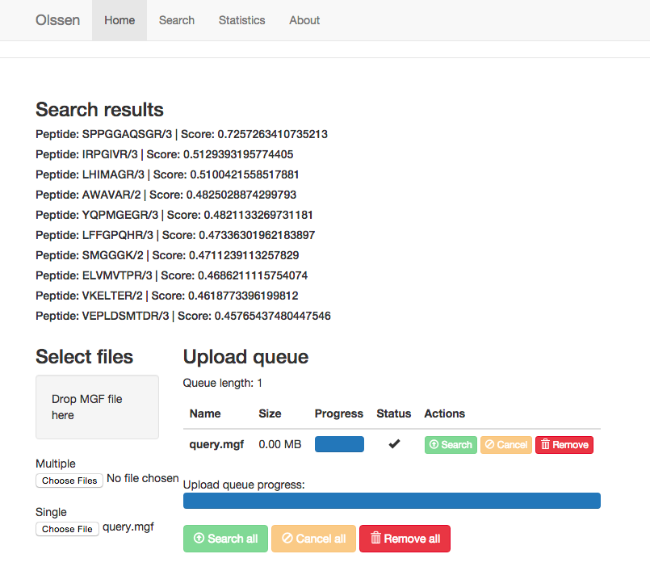

# Olssen 
### an OnLine Spectral Search ENgine  

Our engine provides a [RESTful-like API](https://github.com/jadianes/olssen/tree/master/ws) to perform **on-line spectral search** for proteomics
spectral data. It is based on the [SpectraST](http://tools.proteomecenter.org/wiki/index.php?title=Software:SpectraST) 
algorithm for spectral search and uses [PRIDE Cluster spectral libraries](http://wwwdev.ebi.ac.uk/pride/cluster/#/libraries).  

## Components  

#### [Olssen Web Service](https://github.com/jadianes/olssen/tree/master/ws)  

The [server](https://github.com/jadianes/olssen/tree/master/ws) is buit for scalability and performance working with big datasets. It uses 
[Flask](http://flask.pocoo.org/) on top of [CherryPy's server](http://www.cherrypy.org/) 
and performs its spectral searches using an engine based on [Apache Spark](https://spark.apache.org/) 
clusters.  

#### [Olssen GUI](https://github.com/jadianes/olssen/tree/master/gui)  

The client [Web Application](https://github.com/jadianes/olssen/tree/master/gui) can be used on top of the web service and is ideal for data visualisation and individual spectral search.  

 

This GUI AngularJS project is generated with [yo angular generator](https://github.com/yeoman/generator-angular)
version 0.12.0.

## Concepts  

These are some IPython/Jupyter notebooks to explore different spectral search concepts and
procedures used in our on-line search server.  

#### [Loading a PRIDE Cluster library into a Spark RDD](notebooks/read-spectrum-lib.ipynb)  

#### [The SpectraST algorithm for spectral search](notebooks/spectraST.ipynb)  
